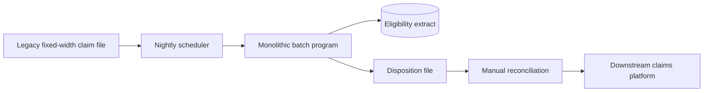
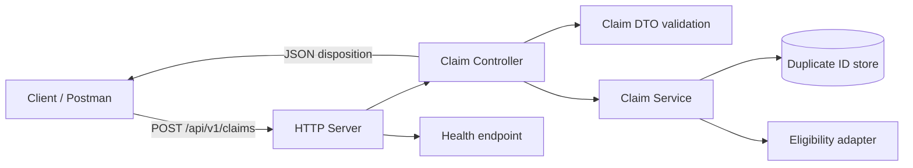

# Architecture — Batch to REST (One Page)

## Before: nightly, opaque handoffs

The legacy path couples transport, parsing, validation, eligibility, and output formatting. A claim waits for the batch window; failures are file-level; callers receive no immediate, claim-level response.

## After: synchronous, layered service

| Concern | Legacy batch | REST service |
| --- | --- | --- |
| Trigger | Scheduled file | On-demand HTTP request |
| Contract | Positional record | Versioned JSON DTO |
| Validation | Batch/file failure | Claim-level HTTP 400 details |
| Business outcome | Output code/file | Typed JSON disposition |
| Duplicate control | Batch history lookup | Service-owned ID set (replaceable repository) |
| Testability | End-to-end job | DTO, controller, service, and HTTP boundaries |

The controller owns contract translation, the DTO owns input validation, and the service owns ordered business rules (duplicate before eligibility). This separation enables persistence and external eligibility adapters without changing the API contract. The current in-memory adapters are demo-safe, not production durable.
